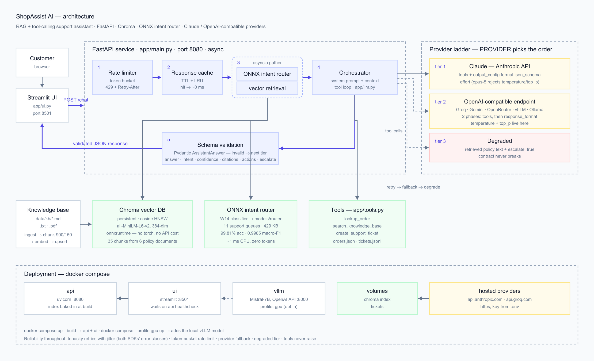
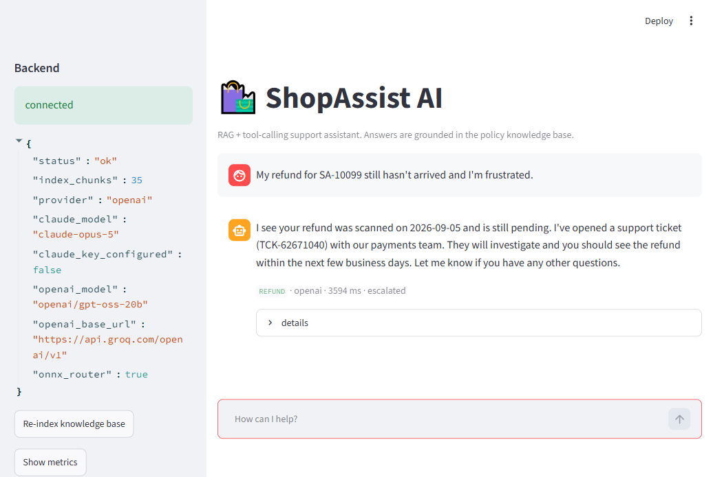

# ShopAssist AI — RAG + tool-calling support assistant

Week 15 assignment, Tasks 1 and 2, delivered as **one production application**.

It is the customer-support router from Week 14 grown into a real product: an
incoming shopper message is classified by the fine-tuned intent model (exported to
**ONNX**), grounded in a **vector-searched policy knowledge base**, answered by an
**LLM with function calling**, and returned as **schema-validated JSON** — with
retries, rate limiting, caching, a second provider as fallback, and a degraded tier
that still answers when everything upstream is down.

It runs on **Claude** or on any **OpenAI-compatible endpoint** — including free ones
(Groq, Google Gemini, OpenRouter) and a model on your own machine (vLLM, Ollama).
`PROVIDER` picks which leads; the other becomes the fallback. Both are full
providers, with tool calling and structured output.

```
Customer → Streamlit UI → FastAPI → [ONNX intent router ‖ Chroma retrieval]
                                  → LLM (tools + JSON schema)
                                  → validated ChatResponse
```

**Architecture diagram: [docs/architecture.png](docs/architecture.png)** (source:
[architecture.svg](docs/architecture.svg)). Sequence and deployment diagrams:
[docs/ARCHITECTURE.md](docs/ARCHITECTURE.md). Assignment checklist:
**[DELIVERABLES.md](DELIVERABLES.md)**.





---

## 1. Quick start

### Docker (recommended)

```bash
cd 15th-assigment
cp .env.example .env          # paste one API key into it — see below
docker compose up --build     # api :8080, ui :8501
```

Open <http://localhost:8501>. Add a local open-source model on a GPU host with
`docker compose --profile gpu up --build`.

### Getting a key (free options, no credit card)

`.env.example` ships configured for **Groq** — you only fill in `OPENAI_API_KEY=`.

| Provider | Key from | Free limits | `OPENAI_MODEL` |
|---|---|---|---|
| **Groq** (default) | <https://console.groq.com/keys> | ~14,400/day, 30/min | `openai/gpt-oss-20b` |
| Google Gemini | <https://aistudio.google.com/apikey> | 1,500/day, 15/min | `gemini-2.5-flash` |
| OpenRouter | <https://openrouter.ai/keys> | ~200/day, 20/min | `meta-llama/llama-3.3-70b-instruct:free` |
| Your own machine | no key needed | unlimited | whatever vLLM or Ollama serves |
| Anthropic | <https://console.anthropic.com> | paid | `claude-opus-5`, with `PROVIDER=claude` |

The four OpenAI-compatible options share one code path — only `OPENAI_BASE_URL` and
`OPENAI_MODEL` change, and each is a commented block in `.env.example`. With no key
at all the app still runs and answers from the degraded tier.

### Local Python

```bash
python -m venv .venv && .venv/Scripts/activate      # Linux/macOS: source .venv/bin/activate
pip install -r requirements-dev.txt
cp .env.example .env

uvicorn app.main:app --port 8080 --reload           # terminal 1
streamlit run app/ui.py                             # terminal 2
pytest -q                                           # 20 tests, no API key needed
```

The knowledge base is indexed automatically on first boot.

### Try it

```bash
curl -s localhost:8080/chat -H 'content-type: application/json' \
  -d '{"message":"Where is my order SA-10231?"}' | jq
```

A real reply, captured from a live run on Groq's free tier:

```json
{
  "answer": "Your order SA-10231 was shipped on 2026-08-28 via DHL and is expected to arrive by 2026-09-02. The tracking number is JD0002210934 ...",
  "intent": "ORDER",
  "confidence": 0.95,
  "citations": [],
  "actions": ["lookup_order"],
  "escalate": false,
  "model": "openai/gpt-oss-20b",
  "provider": "openai",
  "cached": false,
  "latency_ms": 3614,
  "router_intent": "ORDER",
  "router_confidence": 0.4141,
  "degraded_reason": null
}
```

### Verified end-to-end runs

| Question | Tools the model chose | Result |
|---|---|---|
| *How long do credit card refunds take?* | none needed | answered from `refunds_and_returns.md#3`, cited, 3.5 s |
| *Where is my order SA-10231?* | `lookup_order` | real status, carrier, tracking number and ETA, 3.6 s |
| *My refund for SA-10099 hasn't arrived and I am furious* | `lookup_order` + `create_support_ticket` | confirmed the 2026-09-05 scan date, opened `TCK-951FBE1E` at `high`, `escalate: true`, 4.1 s |
| *Can I still cancel SA-10244?* | `lookup_order` | saw status `PROCESSING`, applied the cancellation policy correctly, 2.3 s |
| the first question, asked again | — | served from cache, `X-Cache: HIT`, **0 ms** |

### Free-tier rate limits are real

Groq's free tier allows 8,000 tokens per minute **per model**, and a turn costs
roughly 2-4k (two phases, see below). Fire four questions back to back and the
fifth gets a `429`. That is what the reliability layer is for: the retry backs off,
then the fallback provider takes over, then the degraded tier answers from the
knowledge base — the caller always gets a valid `ChatResponse`. To raise the ceiling,
configure a second provider so the fallback is a real model, or switch to a model
with a fresh bucket (`openai/gpt-oss-120b` is the stronger sibling).

---

## 2. API

| Method | Path | Purpose |
|---|---|---|
| `POST` | `/chat` | Ask a question. Body `{message, history?, session_id?}` → `ChatResponse` |
| `POST` | `/ingest` | Re-index `data/kb/` after editing documents |
| `GET` | `/health` | Index size, configured models, whether the ONNX router is loaded |
| `GET` | `/metrics` | Counters, cache hits, tool-call counts, p50/p95 latency |
| `GET` | `/schema` | The JSON schema every answer is constrained to |
| `GET` | `/docs` | Interactive OpenAPI docs |

`429` carries a `Retry-After` header. Responses carry `X-Cache: HIT|MISS`.

---

## 3. Task 1 — Applied AI

### LLM integration
`app/llm.py`. Two providers, both async, both with per-request timeouts and SDK-level
retries disabled so the retry policy lives in exactly one place: the **Anthropic SDK**
for Claude, and the **OpenAI SDK** pointed at any compatible endpoint (Groq,
OpenRouter, Gemini, vLLM, Ollama). They implement the same interface, so the fallback
is a peer rather than a stub.

### Prompt engineering
`SYSTEM_PROMPT` in `app/llm.py` is a six-rule contract: ground every claim in
retrieved context, cite the chunk ids actually used, prefer tools over asking the
customer, escalate under the knowledge base's own escalation rules, never handle card
numbers, stay under 120 words. The retrieved chunks and the router's intent prior go
in the **user** turn, so the system prompt stays byte-identical across requests and
stays cacheable (`cache_control: ephemeral`).

**temperature / top_p.** Both are configuration (`TEMPERATURE=0.2`, `TOP_P=0.9`) —
low temperature because a support bot quoting refund windows should be reproducible,
`top_p` 0.9 to keep the phrasing natural. Every OpenAI-compatible model accepts them,
so with `PROVIDER=openai` they are live on the primary path. The thinking-era Claude
models (`claude-opus-5`, `claude-sonnet-5`) **reject `temperature`/`top_p` with a 400**
and expose `output_config.effort` instead, so `llm.supports_sampling()` decides per
model and `EFFORT` (`low`…`max`) is the equivalent knob there.

### Structured output
`AssistantAnswer` (`app/schemas.py`) is the single contract, and
`json_schema()` renders it as a closed schema (`additionalProperties: false`, every
field required, no `$defs`) that is passed to the model as
`output_config.format.json_schema`, so decoding is constrained rather than merely
requested. OpenAI-compatible providers disagree about structured output, so the code
negotiates instead of guessing: ask for `json_schema`, step down to `json_object` if
the provider rejects it, then to a prompt instruction, and remember the outcome.
Either way the response is validated with Pydantic before it leaves the process — if
it does not validate, the request falls through to the next provider tier instead of
returning prose to a JSON client. `parse_answer()` additionally rescues JSON wrapped
in prose or fences, which smaller open models do occasionally.

### Tool calling
Three tools (`app/tools.py`), executed in a bounded loop (`MAX_TOOL_ITERATIONS=4`):

| Tool | What it does |
|---|---|
| `lookup_order` | order by id or all orders for an email, from `data/orders.json` |
| `search_knowledge_base` | a second, model-directed retrieval pass when the injected context is not enough |
| `create_support_ticket` | escalation — appends to `data/tickets.jsonl`, returns the ticket id |

Tools run in a worker thread, results are JSON-encoded, and `dispatch()` never
raises: an exception comes back to the model as `{"error": ...}` so it can recover or
apologise instead of the request 500-ing. On the Claude path all results for one
assistant turn are returned in a single user message, which is what keeps parallel
tool use working.

**Two-phase turns on OpenAI-compatible providers.** Groq (and others) reject `tools`
and `response_format` in the same request — *"json mode cannot be combined with
tool/function calling"* — so a turn runs as: **phase 1** offers the tools and no
output format, **phase 2** asks for the schema with the tools withdrawn. Phase 2
restates the tool results as plain text on a fresh transcript rather than replaying
tool-call messages, because a transcript containing tool calls keeps some models in
tool-calling mode, where they try to answer by "calling" a synthetic tool named
`json` that is not in `request.tools` and the provider 400s. For the same reason the
"reply in JSON" instruction is kept out of phase 1 entirely (`JSON_INSTRUCTION` is a
separate constant). If a provider rejects the tool phase outright, the code logs it,
skips to phase 2 and still answers.

### RAG pipeline
`app/rag.py`. Ingest `.md` / `.txt` / `.pdf` → split on markdown headings, then a
900-character / 150-overlap window for anything still too long → embed with
`all-MiniLM-L6-v2` (onnxruntime, 384-dim, no torch, no API cost) → upsert into
**Chroma** with cosine HNSW. Chunk ids are `file#position`, so re-ingesting
replaces chunks instead of duplicating them, and the same id is what the model cites.
Retrieval returns the top `k=4` with similarity scores.

### Local deployment with vLLM
The `vllm` service in `docker-compose.yml` serves `mistralai/Mistral-7B-Instruct-v0.3`
on its OpenAI-compatible endpoint. Because vLLM speaks the OpenAI API, it is the same
`app/llm.py` code path as Groq or Gemini: point `OPENAI_BASE_URL` at it and nothing
else changes, tool calling included. It sits behind the `gpu` compose profile so the
rest of the stack runs on a laptop with no GPU.

### Containerisation
`Dockerfile` — one image, non-root user, dependency layer cached separately, the
embedding model **and** the built vector index baked in at build time so a cold
container serves its first request without downloading or indexing anything, plus a
`HEALTHCHECK` that compose gates the UI on.

---

## 4. Task 2 — Productionising

### Web UI
`app/ui.py` — Streamlit chat with history, an expandable raw-JSON panel per answer,
per-message badges (intent, provider, latency, cached, escalated), a live backend
health panel, and re-index / metrics buttons. It holds no key, no model and no index;
it only calls the API, so the two scale independently.

### Model optimisation — ONNX
`scripts/train_router.py` trains the Week 14 intent classifier and exports it to
ONNX; `app/router.py` serves it with **onnxruntime only — torch is not in the
serving image**.

```bash
python scripts/train_router.py --backend tfidf        # ~20 s on CPU, shipped in models/router/
python scripts/train_router.py --backend distilbert   # the W14 encoder, GPU recommended
```

Shipped artifact (`models/router/metrics.json`), Bitext test split, 2 688 held-out messages:

| accuracy | macro-P | macro-R | macro-F1 | train time | artifact |
|---|---|---|---|---|---|
| 0.9981 | 0.9986 | 0.9984 | 0.9985 | 6.3 s | 429 KB |

Both backends emit the same three files (`model.onnx`, `labels.json`, `metrics.json`,
plus `tokenizer.json` for the transformer); the loader detects the graph shape and
feeds it accordingly. Below `ROUTER_MIN_CONFIDENCE` (0.35) the router returns nothing
rather than hand the LLM a misleading prior.

**What is *not* converted to ONNX, and why.** The generative model is not — Claude is
a hosted API, and a 7B decoder is served by vLLM, whose PagedAttention + continuous
batching runtime is strictly faster than an ONNX Runtime export for autoregressive
serving. ONNX earns its place on the small, high-QPS classifier that runs on **every**
request: ~1 ms on CPU with no tokens billed, versus ~1 s and an LLM call to answer
"which of 11 queues is this".

### Performance engineering
- **Async end to end.** FastAPI + `AsyncAnthropic`; Chroma and onnxruntime are
  synchronous, so they run in `asyncio.to_thread` and never block the event loop.
- **Concurrent, not sequential.** Intent routing and vector retrieval are
  independent, so they run under one `asyncio.gather` — the request pays for the
  slower of the two, not the sum.
- **Prompt caching.** The frozen system prompt and tool list are marked
  `cache_control: ephemeral`; volatile content (context, message) sits after them so
  the cached prefix survives.
- **Response caching** (bonus). `cachetools.TTLCache`, keyed on the normalised
  message plus history; repeat FAQs return in ~1 ms. Failures are never cached.
- **Benchmark.**

  ```bash
  python scripts/bench.py --n 40 --concurrency 8            # cache warm
  python scripts/bench.py --n 40 --concurrency 8 --unique   # cache bypassed
  ```

  Reports throughput and p50/p95/max latency, and which tier served each request.

### Reliability

| Requirement | Implementation |
|---|---|
| Retry | `tenacity`, exponential backoff with jitter, `MAX_RETRIES=3`, only on genuinely transient failures (connection, timeout, 429, 5xx) — and the predicate knows **both** SDKs' exception classes, or a provider's 429 sails straight past the retries. 4xx other than 429 fails fast. Both SDKs' own retries are disabled so the policy is not applied twice. |
| Rate limiting | Async token bucket, `RATE_LIMIT_PER_MINUTE=30`, returns `429` with `Retry-After`. |
| Fallback provider | Primary → the other provider → degraded answer, ordered by `PROVIDER`. Both real tiers have tools and structured output, so a fallback is a full answer and not a downgrade. Each hop is logged and counted, and the tier that served the request is reported in `provider`. |
| Error handling / graceful degradation | Tool errors return to the model instead of raising; a refusal or an unparseable answer demotes to the next tier; if every provider is down the API still returns a valid `ChatResponse` containing the closest policy text with `escalate: true`. The client contract never breaks. |

### Deployment
`docker-compose.yml` — `api`, `ui`, and the GPU-profiled `vllm`, with named volumes
for the index and the tickets.

```bash
docker compose up --build              # api + ui
docker compose --profile gpu up        # + local vLLM model (needs an NVIDIA GPU)
docker compose logs -f api
docker compose down -v                 # also drops the index volume
```

**Cloud (not deployed, instructions only).** The image is a plain stateless web
service, so any container host works, e.g. Azure Container Apps:

```bash
az acr build -r <registry> -t shopassist-ai:1.0.0 .
az containerapp create -n shopassist -g <rg> --environment <env> \
  --image <registry>.azurecr.io/shopassist-ai:1.0.0 --target-port 8080 --ingress external \
  --secrets anthropic-key=<key> --env-vars ANTHROPIC_API_KEY=secretref:anthropic-key \
  --min-replicas 1 --max-replicas 5
```

Before running more than one replica, move the two process-local pieces to shared
services: the rate-limiter bucket and the response cache to Redis, and Chroma from
the embedded persistent client to a Chroma server (one line in `app/rag.py`).

---

## 5. Layout

```
15th-assigment/
├── app/
│   ├── config.py        pydantic-settings, every knob overridable by env
│   ├── schemas.py        AssistantAnswer + the JSON schema sent to the model
│   ├── rag.py            ingest → chunk → embed → Chroma → retrieve
│   ├── router.py         ONNX intent classifier (onnxruntime, no torch)
│   ├── tools.py          tool definitions + safe dispatch
│   ├── llm.py            Claude → vLLM → degraded, retries, tool loop
│   ├── reliability.py    token bucket, TTL cache, metrics
│   ├── main.py           FastAPI service
│   └── ui.py             Streamlit chat
├── data/kb/              6 policy documents → 35 chunks
├── data/orders.json      mock order database behind lookup_order
├── models/router/        the exported ONNX classifier (429 KB, committed)
├── scripts/
│   ├── train_router.py   train + export to ONNX (tfidf | distilbert)
│   └── bench.py          concurrency / latency benchmark
├── tests/test_app.py     20 offline tests (both tool loops, stubbed)
├── docs/ARCHITECTURE.md  diagrams and design decisions
├── Dockerfile · docker-compose.yml · .env.example
└── requirements*.txt     serving / training / dev split
```

## 6. Configuration

Every field in `app/config.py` is an environment variable (see `.env.example`). The
ones worth turning: `PRIMARY_MODEL`, `TEMPERATURE`, `TOP_P`, `EFFORT`, `TOP_K`,
`CHUNK_SIZE`, `RATE_LIMIT_PER_MINUTE`, `MAX_RETRIES`, `CACHE_TTL_SECONDS`,
`ROUTER_MIN_CONFIDENCE`.

## 7. Known limits

- Rate limiter and response cache are per-process; multi-replica needs Redis.
- `data/orders.json` stands in for an order service; `tools.py` is where a real
  client would go.
- Conversation history is passed by the client; there is no server-side session store.
- OpenAI-compatible turns cost two requests (see the two-phase note above); on a
  provider that accepts `tools` and `response_format` together this could collapse
  to one.
- Some providers send `application/json` with no charset, so UTF-8 punctuation
  arrives doubly encoded; `llm.fix_mojibake` repairs it at the parse boundary.
