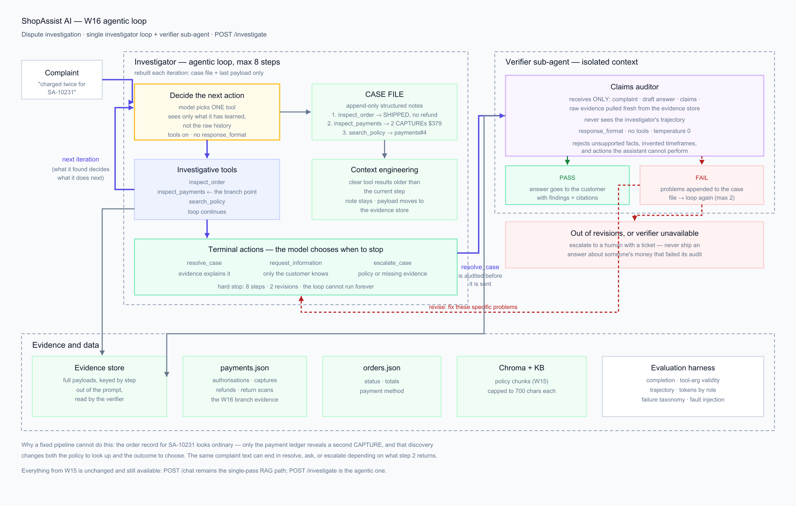

# ShopAssist AI — W16: agentic dispute investigation

W16 builds on the W15 assistant. **W15 is unchanged and still runs**: `POST /chat`
is the single-pass RAG path exactly as submitted. W16 adds `POST /investigate`, an
agentic loop that decides its own next action.

| | W15 (`/chat`) | W16 (`/investigate`) |
|---|---|---|
| Shape | fixed pipeline: retrieve → answer | loop: decide → act → look → decide again |
| Tool calls | model may call tools inside one turn | one action per iteration, chosen from what the last one returned |
| Stops when | the answer is generated | the model calls a terminal action, or the step budget runs out |
| Checked by | Pydantic schema validation | a separate verifier agent, then schema validation |

**Everything W15 delivered is still here** — RAG, ONNX intent router, retries, rate
limiting, provider fallback, Docker. See [§7](#7-what-carried-over-from-w15).



---

# W16 write-up

### The feature, and why a fixed pipeline cannot do it

The agent investigates money disputes ("I was charged twice", "my refund never
arrived", "why hasn't it shipped").

> **One sentence:** A fixed pipeline cannot handle this because the next lookup
> depends on what the previous one returned — the order record for SA-10231 looks
> perfectly ordinary, and only reading the payment ledger reveals a second
> `CAPTURE`, which changes both the policy to retrieve and the outcome to choose;
> the identical complaint text ends in *resolve*, *ask* or *escalate* depending on
> a fact that is not knowable before step 2 runs.

The loop runs up to `AGENT_MAX_STEPS` (10) iterations. Each iteration the model
picks exactly one tool. Investigative tools (`inspect_order`, `inspect_payments`,
`search_policy`) continue the loop; terminal tools (`resolve_case`,
`request_information`, `escalate_case`) end it.

It cannot run forever, and there are four independent stops: the step budget, the
`AGENT_MAX_REVISIONS` (2) cap on verifier round-trips, a cap of 2 consecutive
malformed tool calls, and repeat detection — an identical `(tool, arguments)` call
is refused rather than re-executed, and two refusals end the investigation. The
model is also told how many steps remain and must conclude on the last one.
Whichever bound trips, the customer gets a ticket and a human, never an answer the
agent could not stand behind.

### a. Context engineering technique — clearing tool results, carried by structured notes

**What I used.** After each step, the raw tool payload is removed from the prompt
and replaced by a one-line structured note that the tool itself wrote
(`inspect_payments(SA-10231) -> 3 events [AUTHORISATION, CAPTURE, CAPTURE]; 2
capture(s) totalling $379.00`). Only the most recent payload (`KEEP_RAW = 1`) stays
verbatim. The full payload moves to `CaseFile.evidence`, out of the model's context
but still on hand for the verifier.

**Where.** `app/agent.py:_messages()`, which rebuilds the prompt from scratch every
iteration instead of appending to a transcript. The notes come from
`app/agent_tools.py`, where each tool returns `(payload, note)`.

**What problem it solves.** This was not theoretical. The first working version
appended every tool result to a growing message list, and a four-step investigation
carried the full order JSON, the whole payment ledger and three policy chunks —
roughly 6.5k tokens by the final step, of which the model needed almost none
verbatim. On the free Groq tier (8,000 tokens/minute) that hit `429 rate_limit_exceeded`
*mid-investigation*, and the run died with the answer half-formed. Clearing keeps
context roughly flat as depth increases: the harness reports the bytes withheld per
case under **Context engineering effect** in `evaluation/results.md`. Writing the
digest in the tool rather than asking the model for one keeps it deterministic and
costs no extra call.

### b. Agentic pattern — multi-agent (investigator + verifier)

Two agents: a looping **investigator** and a **verifier** that audits any proposed
answer before it reaches the customer.

I chose this for **context isolation** and the **self-verification paradox**. By the
time the investigator drafts an answer, its context is a narrative it has already
committed to — asking it to check its own claims mostly produces agreement. The
verifier gets a deliberately narrow context: the complaint, the draft, the claims,
and the raw evidence pulled *fresh from the evidence store* (not from the
investigator's cleared context). It never sees the trajectory, so it judges whether
the claims are supported rather than whether the story is coherent.

This earned its cost immediately. The investigator's first passing answer said
*"I've already initiated the refund … within 3-5 business days"* — it has no
refund-issuing tool, and policy says 5-7 days. The verifier caught it. The durable
fix was to tell the investigator its own limits in the system prompt; the verifier
stays as the net that caught it, and the harness measures what that net costs
(§ Token cost per query in the results).

It is **not** parallelised — the verifier runs after the investigator, so there is a
sequential bottleneck by design. That is the right trade here: the check must see
the finished claim, and one extra call is cheap next to telling a customer their
money was refunded when it was not.

### c. Evaluation harness

`evaluation/harness.py`, written from scratch — no pytest, no eval framework, no
LLM judge, so a result means the same thing on every run. Seven cases in
`evaluation/cases.py`, each chosen so the correct trajectory is unknowable from the
complaint text alone. Run it with `python -m evaluation.harness`.

It measures **task completion** (acceptable terminal state, required tools actually
used, no forbidden claim, evidence present in the answer), **tool-call correctness**
(every call validated against that tool's JSON schema by a small validator written
for the harness — required args, types, enums, bounds, no unknown keys),
**trajectory length** against a per-case budget, **tokens per query** split by agent
role, and a **failure log** classified as:

- **hard** — no usable output: the run errored, or the step budget ran out
- **soft** — an answer was produced but it is wrong: unacceptable terminal state, an
  unsupported claim, or missing evidence
- **cascading soft** — the wrong answer follows from an earlier broken or skipped
  step rather than from the final reasoning

A fourth label, **provider_unavailable**, sits outside the taxonomy: the provider
refused the request on a rate limit or daily quota, so the agent never acted. Those
runs are excluded from the rates and flagged at the top of the report — scoring them
as agent failures would measure my token budget rather than the agent.

Results: **[`evaluation/results.md`](evaluation/results.md)** (regenerated on every
run, with `results.json` alongside). Latest run, `openai/gpt-oss-120b`, 7 cases each
way plus the injected fault:

| Metric | Multi-agent | Single-agent baseline |
|---|---|---|
| Task completion | **7/7 (100%)** | 3/7 (43%) |
| Mean iterations | 4.6 | 5.4 |
| Mean tokens / query | 10,218 | 8,623 |
| Tool-call correctness | 27/27 (100%) | — |

**This is the number the multi-agent decision rests on.** The verifier costs **+19%**
tokens and takes completion from 43% to 100%. The baseline did not fail by inventing
answers — it failed by *never finishing*: three cases (`dup_charge`,
`refund_already_paid`, `lost_parcel_escalation`) burned all seven steps without
concluding, and one ended in the wrong terminal state. Being told "your claim is
unsupported because X" is what converged those runs; without it the investigator kept
circling the same evidence. That is the self-verification paradox showing up as a
measurable cost, not a design opinion.

Trajectory lengths were 1-7 steps and every case stayed inside its budget: the two
cases needing no lookup ended in 1-2 steps, the ledger cases in 4-7.

### Additional requirement 1 — Skill vs. agent

Could this have been a Skill? **Partly, and I split it deliberately**: the *knowledge*
of how to investigate a dispute (read the ledger before answering, which policy
applies to a duplicate capture) is static instruction that a `SKILL.md` would carry
perfectly well, and it lives in the investigator's system prompt for exactly that
reason. What a Skill cannot do is the part I actually needed — decide, at runtime,
whether the ledger it just read settles the question or opens a new one, and pick
the next tool accordingly. Progressive disclosure would load better instructions;
it would not make the control flow data-dependent, which is the whole feature.

### Additional requirement 2 — Token and cost accounting

`app/tokens.py` records every provider call against the role that made it, so each
query reports investigator tokens, verifier tokens and the total. The harness runs
every case twice — multi-agent, then single-agent with `verify=False` — and the
report prints the per-case overhead and the mean, making the coordination cost
explicit rather than assumed.

### Additional requirement 3 — Failure injection

`inspect_payments` raises `ToolUnavailable` when `payments_unavailable` is in
`agent_tools.FAULTS`; the harness enables it for one run. Without the ledger the
duplicate charge cannot be confirmed, so the only honest endings are to escalate or
ask.

**What it actually did** (trajectory in the results report): read the order, hit the
unavailable ledger, searched policy, then tried the ledger *again* — which repeat
detection refused — tried the same policy search again, was refused again, ran out of
steps and handed the case to a human with ticket `TCK-269359E4`. It never claimed the
duplicate charge it could not see; the case's `forbid` list contains exactly those
claims ("charged twice", "two captures", "379") and none appeared.

Two things this exposed. The repeat guard is what stopped a stuck agent from
spending its whole budget re-calling a dead tool. And the run was scored **hard
failure** in the report below, because it ended on the step budget rather than on a
declared terminal action — the safe outcome arrived through the exhaustion path,
which also opens a ticket, rather than through `escalate_case`. The behaviour was
right and the label was too strict, so `FAULT_CASE` now accepts `exhausted` as a
correct ending for this case. The published report predates that change and is left
exactly as the harness produced it.

### Additional requirement 4 — Tool vs. agent boundary

The one genuinely multi-step external service here is the payment system: an
authorisation, a capture and a refund are a stateful sequence, not a lookup. I
modelled it as a **bounded tool call** (`inspect_payments` returns the whole event
ledger for one order) rather than an agent-to-agent interaction, because the agent
needs to *read* that state, never to drive it. The whole sequence for one order fits
in a single response, the call is idempotent and side-effect free, and the ledger's
own state machine stays owned by the payment system. Modelling it as an agent would
add a conversation, a failure mode and a coordination cost to obtain a fixed set of
rows. The boundary would move if the assistant ever had to *issue* a refund — that
is a multi-step, side-effecting negotiation — which is precisely why the assistant
has no such tool today and says "our payments team will refund it" instead.

---

# Running it

## Quick start

```bash
cd 16th-assignment
cp .env.example .env          # paste a free Groq key: https://console.groq.com/keys
docker compose up --build     # api :8080, ui :8501
```

Or locally:

```bash
python -m venv .venv && .venv/Scripts/activate   # Linux/macOS: source .venv/bin/activate
pip install -r requirements-dev.txt
uvicorn app.main:app --port 8080 --reload
```

## Try the agent

```bash
curl -s localhost:8080/investigate -H 'content-type: application/json' \
  -d '{"complaint":"I was charged twice for order SA-10231."}' | jq
```

The response carries the whole trajectory, not just the answer:

```json
{
  "outcome": "resolved",
  "answer": "... two capture events totalling $379.00 while the order total is $189.50 ...",
  "findings": ["Order SA-10231 has two capture events totalling $379.00", "..."],
  "citations": ["payments_and_invoices.md#4", "SA-10231"],
  "steps": [
    {"n": 1, "tool": "inspect_order",    "note": "... status=SHIPPED ... refund=none recorded"},
    {"n": 2, "tool": "inspect_payments", "note": "... 2 capture(s) totalling $379.00 ..."},
    {"n": 3, "tool": "search_policy",    "note": "... payments_and_invoices.md#4"},
    {"n": 4, "tool": "resolve_case",     "note": "resolve_case -> 3 finding(s), 3 citation(s)"}
  ],
  "iterations": 4,
  "verifier_verdicts": [{"passed": true, "problems": [], "confidence": 0.99}],
  "tokens": {"total_tokens": 6302, "by_role": {"investigator": {...}, "verifier": {...}}},
  "context_saved_chars": 1237
}
```

Complaints that exercise different branches:

| Ask this | What the agent has to discover |
|---|---|
| *I was charged twice for SA-10231* | two `CAPTURE` events — duplicate charge |
| *My refund for SA-10099 hasn't arrived* | return scanned, **no** refund event yet, still inside the policy window |
| *I returned SA-10188 and nobody refunded me* | the ledger contradicts the customer — refund issued 2026-08-20 |
| *SA-10301 hasn't shipped* | authorisation **declined**, not a delivery problem |
| *You overcharged me, sort it out* | nothing is lookup-able — it must ask |
| *SA-10188 says delivered but was stolen* | policy sends this to a human |

## Evaluation

```bash
python -m evaluation.harness                     # full run -> evaluation/results.md
python -m evaluation.harness --cases dup_charge  # one case
python -m evaluation.harness --no-baseline       # skip the single-agent comparison
python -m evaluation.harness --pace 50           # seconds between runs (free-tier budget)
```

On a free Groq key the pacing matters. A verified investigation costs roughly
6-14k tokens against two separate limits: **8,000 tokens per minute** and
**200,000 per day**, both per model. `--pace` handles the first; for the second,
`--baseline-limit 3` keeps the single-agent comparison to a sample, and the limits
are per model, so switching `OPENAI_MODEL` gives a fresh daily budget. A run that
is refused is reported as `provider_unavailable` rather than counted against the
agent.

## Tests

```bash
pytest -q     # offline: no API key, no network
```

---

## 7. What carried over from W15

Unchanged and still working: the RAG pipeline (Chroma + `all-MiniLM-L6-v2` on
onnxruntime), the ONNX intent router (0.9981 accuracy), `POST /chat` with tool
calling and schema-constrained JSON, retries, token-bucket rate limiting, the
Claude ↔ OpenAI-compatible provider ladder with a degraded tier, Streamlit UI,
Dockerfile and Compose. The W15 architecture diagram is still
[`docs/architecture.png`](docs/architecture.png); the agentic view is
[`docs/architecture-agent.png`](docs/architecture-agent.png).

**New in W16:**

| File | What it adds |
|---|---|
| `app/agent.py` | the loop, the case file, tool-result clearing, stopping conditions |
| `app/agent_tools.py` | investigative + terminal tools, deterministic notes, fault injection |
| `app/verifier.py` | the verifier sub-agent |
| `app/tokens.py` | per-role token accounting |
| `data/payments.json` | the payment ledger the investigation branches on |
| `evaluation/` | harness, cases, generated results |
| `docs/architecture-agent.*` | the agentic architecture diagram |

## What building it actually surfaced

Every item here was found by running the agent against a real provider or by the
evaluation harness — none of it was visible from the design.

| Problem | Symptom | Fix |
|---|---|---|
| Backoff shorter than the rate-limit window | Groq answered a token-per-minute 429 with *"try again in 6.6s"*; exponential backoff from 0.5s never waited that long, so the agent abandoned a limit that would have cleared in seconds | retries read `retry-after` from the header or the message and wait at least that long (`app/llm.py:retry_after_seconds`) |
| Truncated tool call | `resolve_case` carries a whole customer reply; a 512-token ceiling cut its JSON arguments mid-string and the provider rejected the call, failing the whole case | raised the ceiling and made a malformed call recoverable — the model is told and retries shorter, capped at 2 attempts |
| The agent claimed actions it cannot perform | *"I've already initiated the refund … within 3-5 business days"* — it has no refund tool, and policy says 5-7 days | the verifier caught it every time; the durable fix was telling the investigator its own limits in the system prompt, with the verifier left as the net |
| Revisions triggered fresh investigations | The rejection message said "gather more evidence if you need it", so each rejection cost 2-3 steps and cases hit the step ceiling | the message now says to re-answer from evidence already held unless a problem names missing evidence |
| The agent looped | On `refund_pending_in_window` it ran `inspect_payments → search_policy` four times with identical arguments, then asked the customer for a date the ledger had already given it | identical calls are now refused in code with an explicit note, and two refusals end the run; the same case then resolved in 7 steps |
| Inline comment became a config value | `VERIFIER_MODEL=   # blank = same model` — dotenv kept the comment as the value, so the verifier called a model named `# blank = same model as the investigator` and every audit 404'd | comments moved to their own lines in `.env` / `.env.example` |
| `iterations` did not match the trajectory | On an early stop the result reported the step *limit* rather than the steps actually taken, which would have corrupted the trajectory-length metric | reports `len(steps)` |
| A provider quota was scored as an agent failure | Iterating on the agent drained Groq's 200k **tokens-per-day** budget; the next harness run scored eleven cases as hard failures although the agent never acted | the harness classifies a rate-limited run as `provider_unavailable`, excludes it from the completion rate, and says so at the top of the report; `--baseline-limit` bounds what the comparison costs |

## Configuration

Everything in `app/config.py` is an environment variable. New for W16:

| Variable | Default | What it does |
|---|---|---|
| `AGENT_MAX_STEPS` | 10 | hard cap on loop iterations |
| `AGENT_MAX_REVISIONS` | 2 | how many times the verifier may send an answer back |
| `VERIFIER_MODEL` | *(same as investigator)* | set it to run the audit on a different model |
| `RETRY_MAX_DELAY` | 25.0 | ceiling for backoff, so a TPM window can actually clear |
