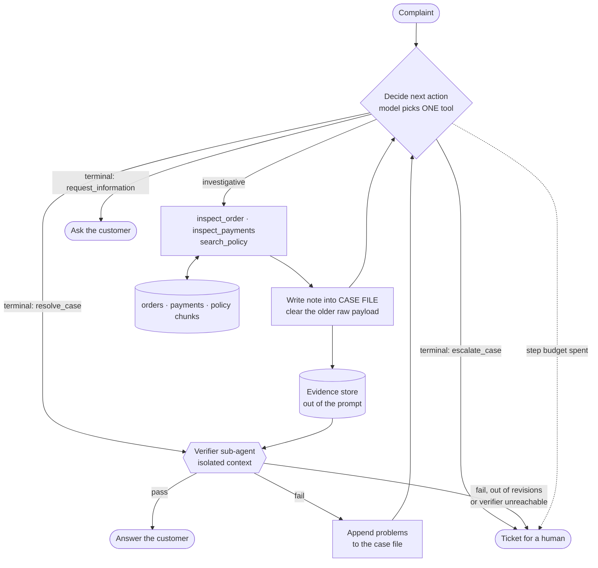
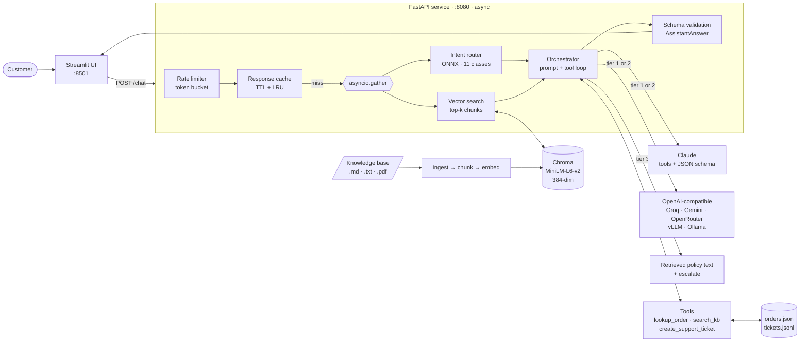
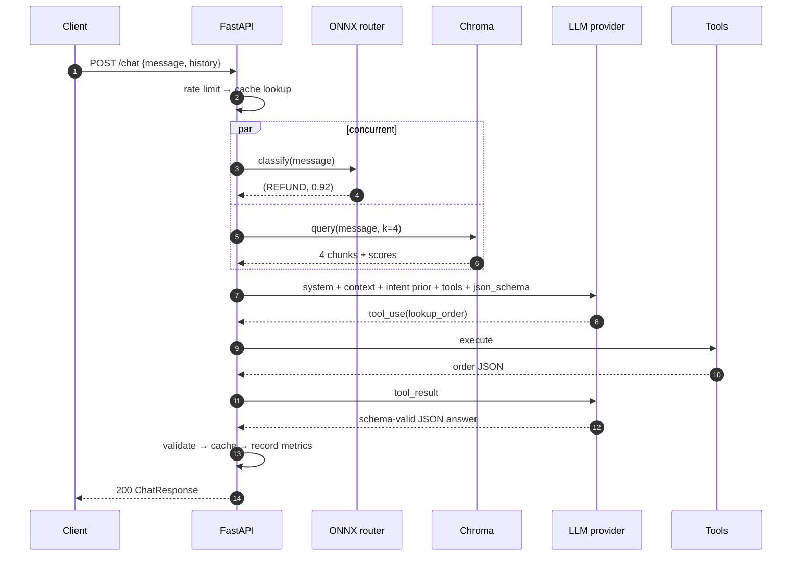
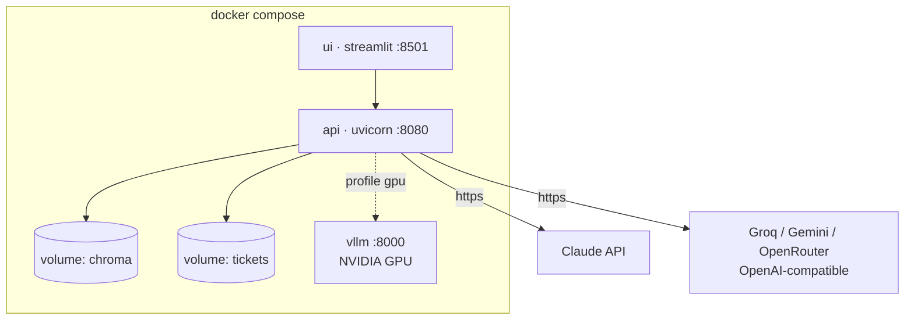

# ShopAssist AI — Architecture

W15 single-pass paths are below; the W16 agentic loop is section 0.

## 0. W16: the agentic loop

Bounds: 10 steps, 2 verifier revisions, 2 malformed-call retries. Every
exhausted bound escalates to a human rather than answering anyway.

Rendered version: [architecture-agent.png](architecture-agent.png).

---

## W15 diagrams

## 1. System overview

## 2. Request lifecycle

## 3. Degradation ladder

`PROVIDER` decides which of the two real providers is tier 1; the other is tier 2.
They are peers — both call tools and both return schema-valid JSON — so a fallback is
a complete answer, not a reduced one.

| Tier | Provider | Tools | Structured JSON | Triggered when |
|------|----------|-------|-----------------|----------------|
| 1 | the one named by `PROVIDER` | yes | constrained decoding | normal operation |
| 2 | the other one | yes | constrained decoding | tier 1 errors after N retries, or its key is unset |
| 3 | none | no | built server-side from the schema | both providers down |

Structured output differs per API and is handled per provider:

| Provider | Mechanism |
|---|---|
| Claude | `output_config.format.json_schema` — always available |
| OpenAI-compatible | `response_format` `json_schema` → `json_object` → prompt instruction, negotiated at runtime on the first `400` and remembered |

Tier 3 still returns a valid `ChatResponse`: the closest policy text, `escalate: true`,
`confidence: 0.0`. The client contract never breaks, so the UI never has to special-case
an outage.

## 4. Component decisions

| Concern | Choice | Why |
|---|---|---|
| Vector DB | Chroma, persistent (SQLite + HNSW) | embedded, no extra service, cosine HNSW, swap for a server by changing one line in `rag.py` |
| Embeddings | `all-MiniLM-L6-v2` via onnxruntime (Chroma default) | 384-dim, CPU-only, no torch in the serving image, no API cost |
| Chunking | markdown-heading split, then 900/150 sliding window | keeps one policy topic per chunk; the window only kicks in for long sections |
| Intent router | W14 classifier exported to ONNX | classification is not a job for a 1M-context LLM: ~1 ms on CPU vs ~1 s and a token bill |
| Providers | one interface, two implementations | Claude and OpenAI-compatible are peers; the fallback ladder is just the list reversed |
| Retries | tenacity, in the provider layer | one visible policy; both SDKs' own retries are disabled (`max_retries=0`) so behaviour is not doubled |
| Rate limit | in-process token bucket | one replica, no Redis; swap for a shared bucket when you run more than one |
| Cache | `cachetools.TTLCache` keyed on normalised message + history | repeat FAQs return in ~1 ms; failures are never cached |
| Concurrency | async FastAPI, blocking work in `asyncio.to_thread` | Chroma and onnxruntime are sync — off the loop they don't block other requests |

## 5. Deployment topology

The `vllm` service sits behind the `gpu` profile: `docker compose up` runs the
assistant on any laptop, `docker compose --profile gpu up` adds the local
open-source fallback on a GPU host.
